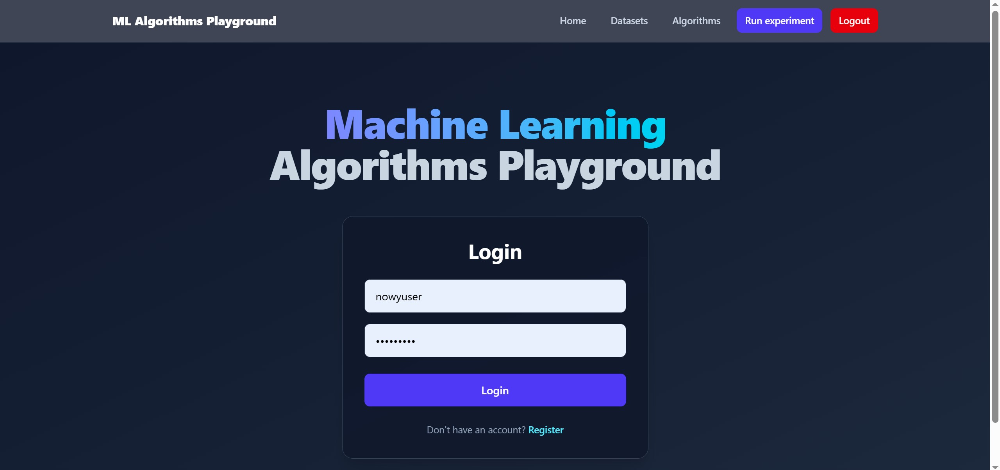
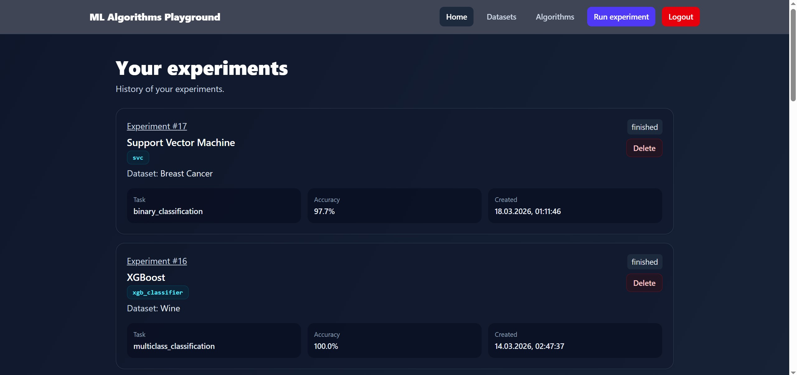
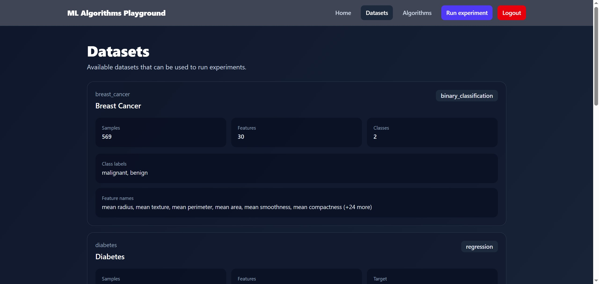
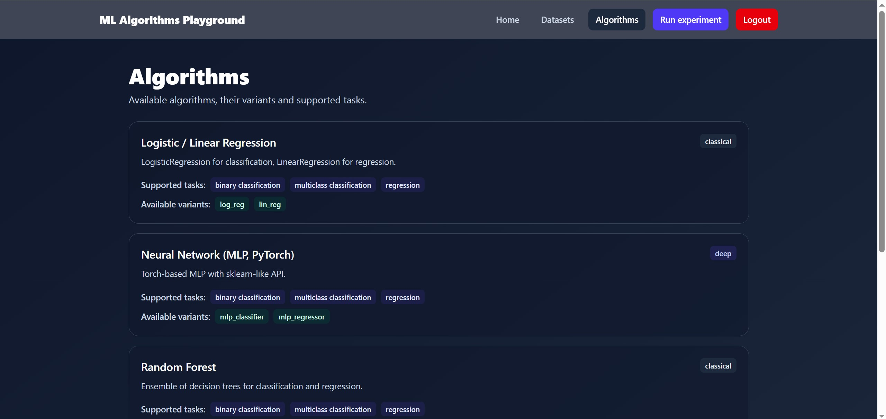
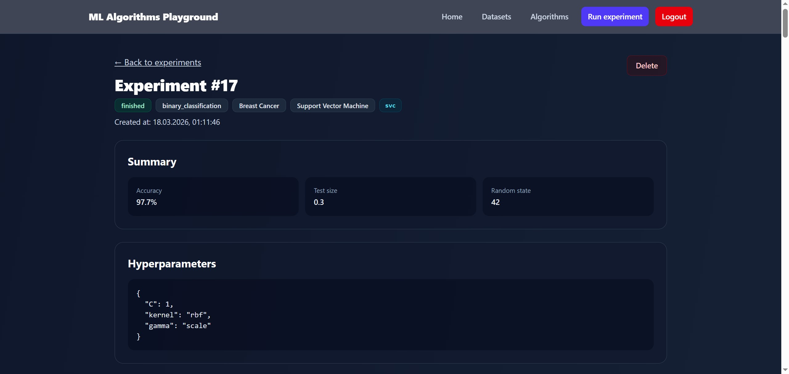
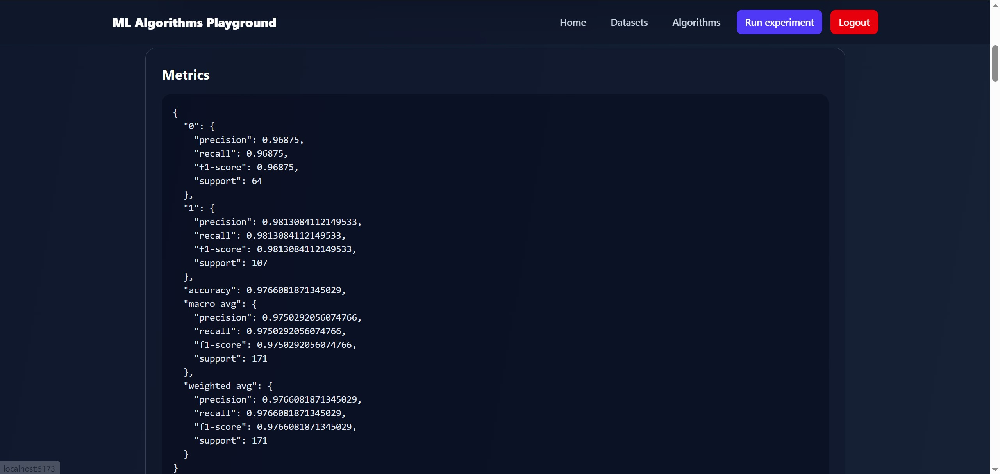
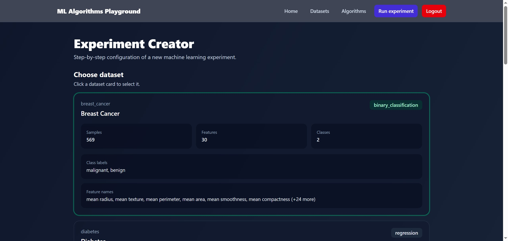
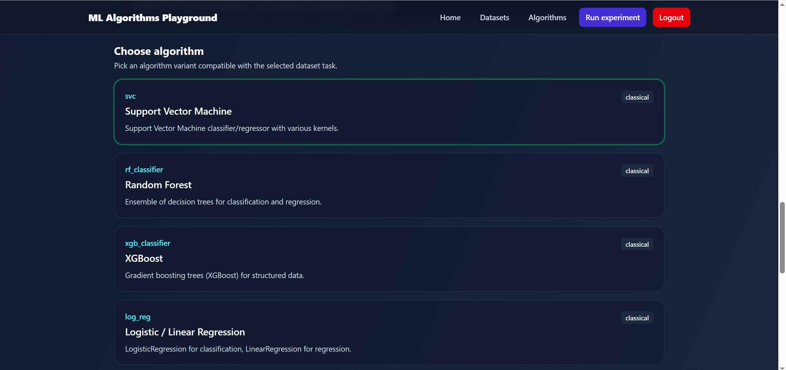
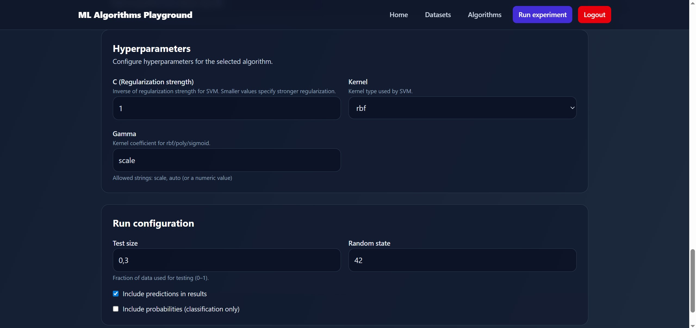
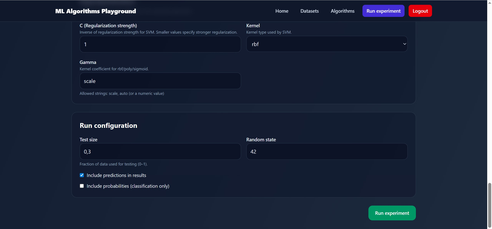

# ML Algorithms Playground

ML Algorithms Playground is an interactive platform that allows users to run machine learning experiments through a web interface.

The project consists of three main layers:

- **ml_core** – computational engine responsible for training, hyperparameter validation, dataset handling, and metrics computation  
- **Django + Django REST Framework** – backend API managing experiments, metadata, datasets, and algorithms  
- **React** – frontend UI for configuring, running, and visualizing experiments *(in progress)*

This project demonstrates backend engineering, ML engineering, API design, and full-stack development.

---

## 🚀 Features

### **Supported Algorithms**

#### Classical (scikit-learn / XGBoost):
- Support Vector Machine (SVC / SVR)
- Random Forest (Classifier / Regressor)
- XGBoost (Classifier / Regressor)
- Logistic Regression / Linear Regression

#### Deep Learning (PyTorch):
- MLPClassifier / MLPRegressor with customizable architecture

---

### **Available Datasets**

- Iris — multiclass classification  
- Wine — multiclass classification  
- Breast Cancer — binary classification  
- Diabetes — regression  
- Synthetic Sinusoidal Function — regression

### Synchronization with Django
All metadata of datasets and algorithms is stored in **ml_core module**, in order to automatically feed Django database with this data 2 sync commends were prepared:
```
python manage.py sync_datasets
python manage.py sync_algorithms
```

## 📦 Experiment System

Each experiment stores:

- Selected dataset  
- Selected algorithm  
- Hyperparameters  
- Train/test split parameters  
- Metrics  
- (Optional) predictions and probabilities  

### Returned results include:
- `y_true`, `y_pred`, `y_proba`
- metrics summary
- dataset & algorithm metadata

Experiment status values:
- `running`
- `finished`
- `failed`

In subsequent stages of the project, it is planned to use background jobs (Celery) to conduct training.
In this case, the experiment will have the status “running”. Currently, everything is carried out synchronously.

---

## 🧩 REST API (Django REST Framework)

### 🔐 JWT Authentication 
The backend authentication layer is implemented using JWT (JSON Web Tokens) provided by Django REST Framework SimpleJWT.
Users authenticate via token-based login, receiving an access token for API authorization and a refresh token for session renewal.
Protected API endpoints require a valid access token, ensuring secure and stateless communication between the frontend and backend.

### Available endpoints:
```
GET /api/datasets/
GET /api/algorithms/
GET /api/experiments/
POST /api/experiments/
GET /api/experiments/<id>/
```

---

## 📤 Example API Request
```
POST /api/experiments/
{
"dataset": 1,
"algorithm": 2,
"hyperparameters": {"C": 1.0, "kernel": "rbf"},
"test_size": 0.3,
"random_state": 42,
"include_predictions": true,
"include_probabilities": true
}
```
**And response:**
```
{
    "dataset": 1,
    "algorithm": 1,
    "hyperparameters": {
        "C": 1.0,
        "kernel": "rbf"
    },
    "test_size": 0.3,
    "random_state": 42,
    "include_predictions": true,
    "include_probabilities": true
}
```
**Then in GET /api/experiments/ can be found:**
```
{
        "id": 11,
        "dataset": {
            "id": 1,
            "name": "Iris"
        },
        "algorithm": {
            "id": 1,
            "name": "Support Vector Machine"
        },
        "task": "multiclass_classification",
        "created_at": "2025-12-06T03:08:18.950169Z",
        "status": "finished",
        "hyperparameters": {
            "C": 1.0,
            "kernel": "rbf"
        },
        "metrics": {
            "0": {
                "precision": 1.0,
                "recall": 1.0,
                "f1-score": 1.0,
                "support": 15.0
            },
            "1": {
                "precision": 0.875,
                "recall": 0.9333333333333333,
                "f1-score": 0.9032258064516129,
                "support": 15.0
            },
            "2": {
                "precision": 0.9285714285714286,
                "recall": 0.8666666666666667,
                "f1-score": 0.896551724137931,
                "support": 15.0
            },
            "accuracy": 0.9333333333333333,
            "macro avg": {
                "precision": 0.9345238095238096,
                "recall": 0.9333333333333332,
                "f1-score": 0.9332591768631814,
                "support": 45.0
            },
            "weighted avg": {
                "precision": 0.9345238095238095,
                "recall": 0.9333333333333333,
                "f1-score": 0.9332591768631814,
                "support": 45.0
            }
        }
    },
```

## 📤 Example API Response GET /api/experiments/
```
{
        "id": 7,
        "dataset": {
            "id": 5,
            "name": "Sinusoid Function"
        },
        "algorithm": {
            "id": 5,
            "name": "Neural Network (MLP, PyTorch)"
        },
        "task": "regression",
        "created_at": "2025-12-06T02:09:41.798903Z",
        "status": "finished",
        "hyperparameters": {},
        "metrics": {
            "mae": 0.018116901112086824,
            "mse": 0.0007040143884720487,
            "rmse": 0.02653326946442991,
            "r2": 0.9985618258401496
        }
    },
    {
        "id": 6,
        "dataset": {
            "id": 1,
            "name": "Iris"
        },
        "algorithm": {
            "id": 1,
            "name": "Support Vector Machine"
        },
        "task": "multiclass_classification",
        "created_at": "2025-12-06T02:02:48.708007Z",
        "status": "finished",
        "hyperparameters": {
            "kernel": "linear"
        },
        "metrics": {
            "0": {
                "precision": 1.0,
                "recall": 1.0,
                "f1-score": 1.0,
                "support": 10.0
            },
            "1": {
                "precision": 1.0,
                "recall": 1.0,
                "f1-score": 1.0,
                "support": 10.0
            },
            "2": {
                "precision": 1.0,
                "recall": 1.0,
                "f1-score": 1.0,
                "support": 10.0
            },
            "accuracy": 1.0,
            "macro avg": {
                "precision": 1.0,
                "recall": 1.0,
                "f1-score": 1.0,
                "support": 30.0
            },
            "weighted avg": {
                "precision": 1.0,
                "recall": 1.0,
                "f1-score": 1.0,
                "support": 30.0
            }
        }
    },
```
## 🌐 Frontend (React)

The frontend is implemented as a modern **single-page application (SPA)** built with **React** and **Vite**.

### Key features
- **JWT-based authentication flow**
  - Login and registration forms
  - Token storage and automatic authorization via Axios interceptors
  - Protected routes preventing access for unauthenticated users


- **Experiment management**
  - List view displaying all experiments created by the authenticated user
  - Status-aware UI (`running`, `finished`, `failed`)
  - Summary metrics (Accuracy for classification, R² for regression)
  - Detailed experiment view including:
    - Dataset and algorithm metadata
    - Hyperparameters
    - Full metrics output
    - Optional predictions
  - Experiment deletion with confirmation






- **Experiment creation wizard**
  - Dataset selection using interactive cards
  - Algorithm selection filtered by dataset task type
  - Dynamic hyperparameter form generated from backend metadata
  - Automatic payload validation before submission
  - Redirect to experiment list after successful execution





- **Architecture & code quality**
  - Feature-oriented component structure
  - Thin routing pages with logic encapsulated in feature components
  - Shared data-fetching logic via reusable hooks
  - Strict separation between UI, services, and business logic

- **Styling**
  - Tailwind CSS for consistent, responsive UI
  - Status-aware badges and semantic visual hierarchy

## 🧪 Tests

The project is planned to include automated tests covering all three layers of the system, with each layer tested according to its responsibility.

### Frontend (React)

Frontend tests focus on critical user flows and UI behavior, including authentication, protected routes, experiment listing, experiment details, and the experiment creation wizard.
Tests are written as integration-style component tests using Vitest, React Testing Library, and MSW (Mock Service Worker) for API mocking.

### Backend (Django REST Framework)

In progress

### ml_core

In progress


## ⚙️ Local Development
First clone repo:
```
git clone https://github.com/MaciejStranz/ml-algorithms-playground.git
cd ml-algorithms-playground
```
After cloning repo create virtual env:
```
python -m venv venv
venv\Scripts\activate
```

Install dependencies:
```
pip install -r requirements.txt
```

Django database migriations and data sync:
```
cd backend
python manage.py migrate
python manage.py makemigrations
python sync_datasets
python sync_algorithms
```
And finally run development server:
```
python manage.py runserver
```


## 🛠 Technology Stack

### Machine Learning
- Python
- NumPy 
- scikit-learn  
- XGBoost  
- PyTorch  

### Backend
- Django  
- Django REST Framework  
- SQLite  

### Frontend (planned)
- React
- Vite
- Tailwind

## 🛣️ Roadmap / Future Development

Planned improvements focus on scalability, usability, and deeper experiment analysis:

- **Containerization & deployment**
  - Dockerize the entire stack (backend + ml_core + frontend + supporting services) to enable reproducible local setup and smoother deployment.

- **Asynchronous experiment execution**
  - Move model training and evaluation to background jobs using **Celery** and a message broker.
  - Enable true `running` experiment states with non-blocking API requests and progress tracking.

- **Model persistence & reuse**
  - Persist trained models and preprocessing artifacts.
  - Allow users to reload trained models for inference without retraining.

- **User-provided data & inference**
  - Enable users to upload custom datasets.
  - Automatically run predictions using selected or previously trained models and return results via the API and UI.

- **Experiment comparison**
  - Introduce a dedicated view for **side-by-side comparison of two experiments**.
  - Compare hyperparameters, datasets, algorithms, and key performance metrics.

- **Extended evaluation & visualization**
  - Add advanced metrics and diagnostics:
    - Confusion matrix
    - Learning curves
    - Additional task-specific metrics
  - Improve experiment interpretability and result analysis.


