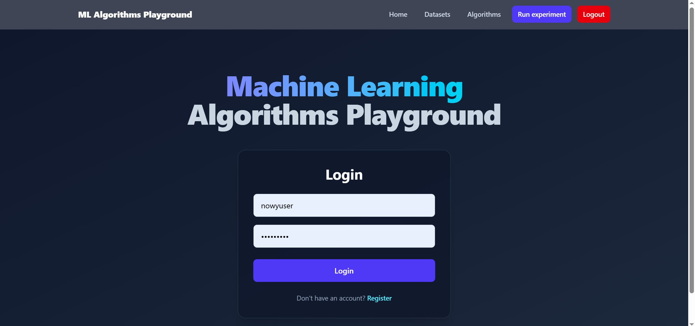
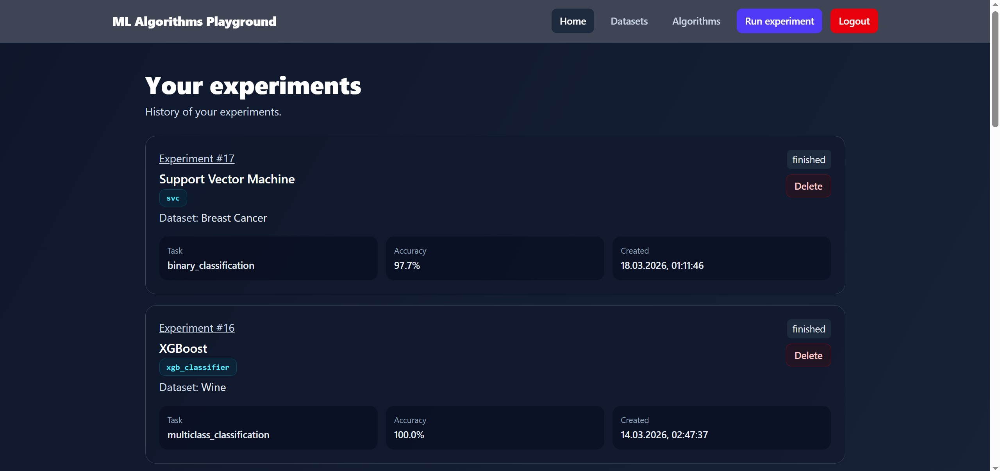
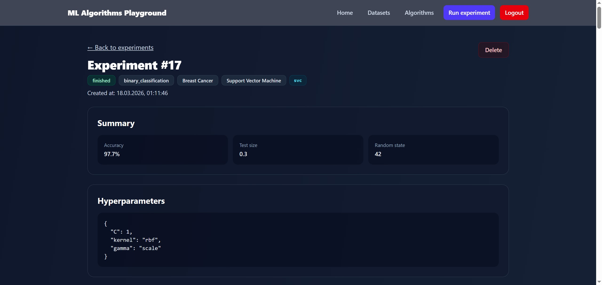
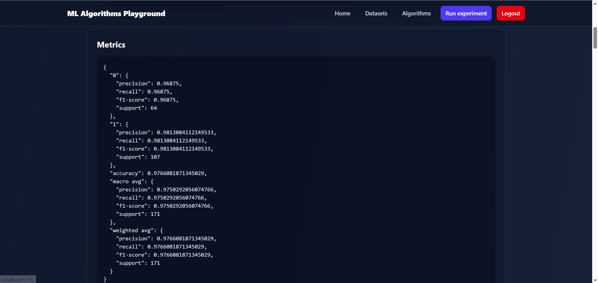
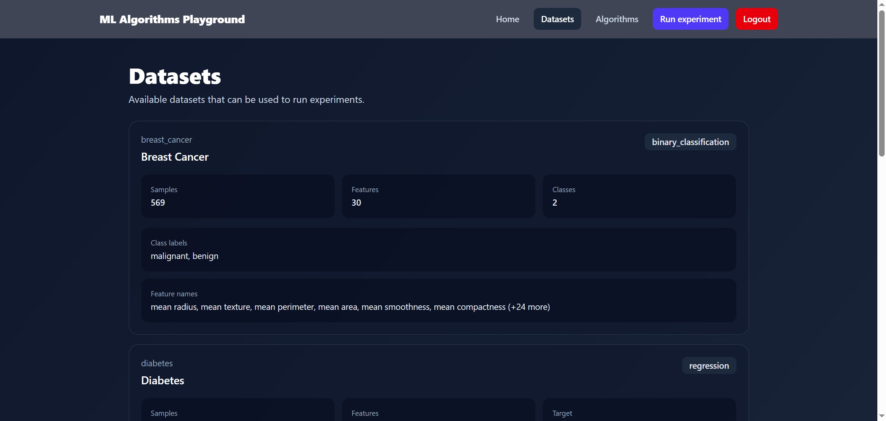
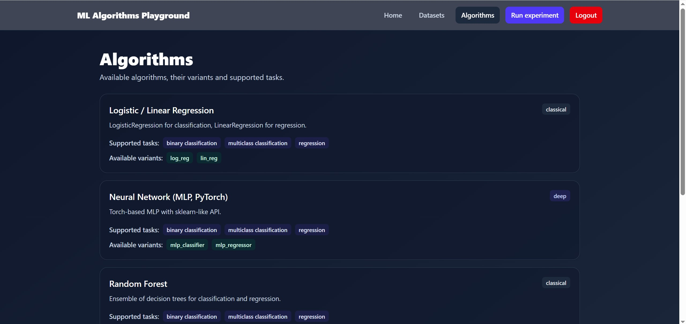
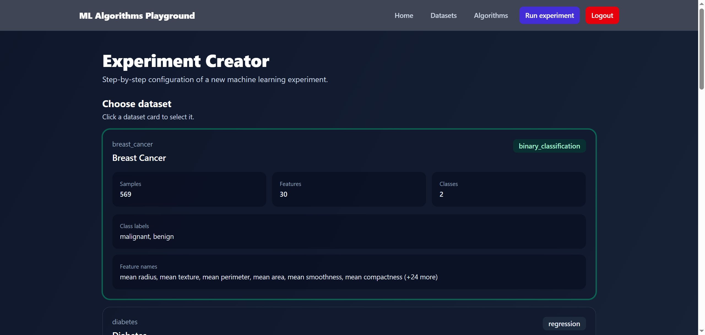
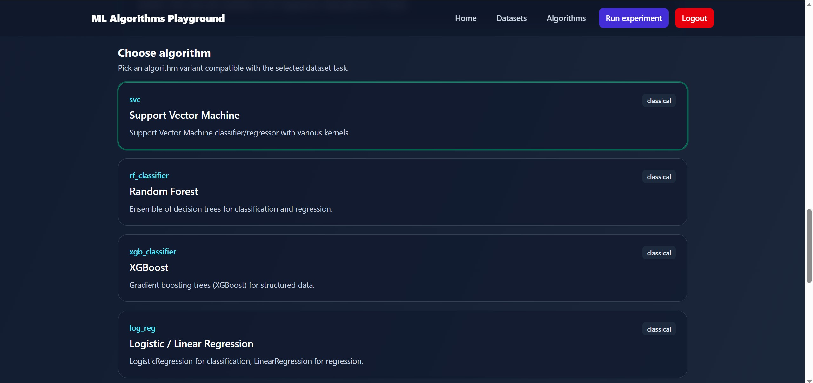
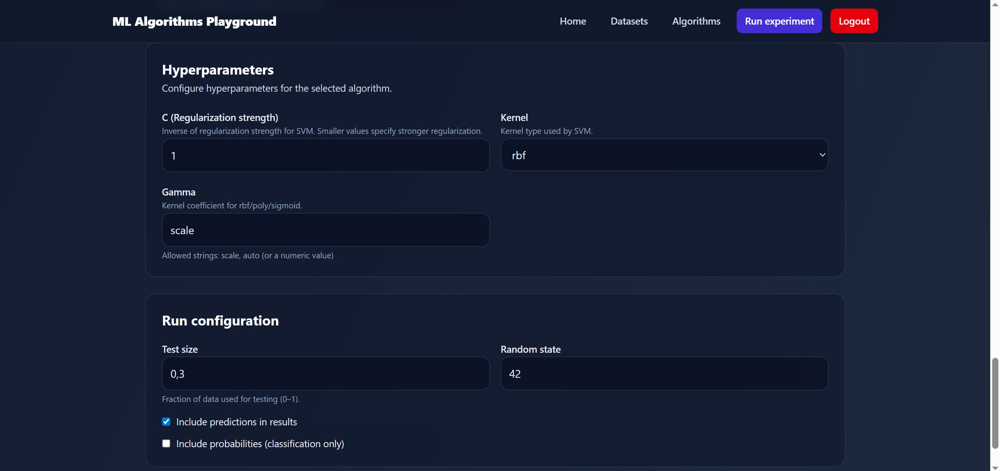
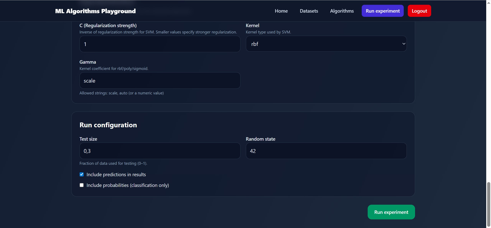

# ML Algorithms Playground

ML Algorithms Playground is an interactive platform that allows users to run machine learning experiments through a web interface.

The project consists of three main layers:

- **ml_core** – computational engine responsible for training, hyperparameter validation, dataset handling, and metrics computation  
- **Django + Django REST Framework** – backend API managing experiments, metadata, datasets, and algorithms  
- **React** – frontend UI for configuring, running, and visualizing experiments 

This project demonstrates backend engineering, ML engineering, API design, and full-stack development.

---

## 🚀 Features

- Run end-to-end machine learning experiments from a web UI
- Choose a dataset and a compatible algorithm for the dataset task
- Configure hyperparameters dynamically based on backend-provided metadata
- View experiment history, detailed results, and summary metrics
- Support both classical ML models and a custom PyTorch MLP
- Secure access to user-specific experiment history with JWT authentication


## Supported Algorithms

- Support Vector Machine (SVC / SVR)
- Random Forest (Classifier / Regressor)
- XGBoost (Classifier / Regressor)
- Logistic Regression / Linear Regression
- MLP (Classifier / Regressor)


## Available Datasets

- Iris - multiclass classification  
- Wine - multiclass classification  
- Breast Cancer - binary classification  
- Diabetes - regression  
- Synthetic Sinusoidal Function - regression

## 🧠 ml_core

`ml_core` is the execution engine of the project. It is intentionally separated from the Django API and React frontend so that training, evaluation, and validation logic remain centralized in one place.

Its responsibilities include:

- loading and splitting supported datasets
- defining available algorithms and task-specific algorithm variants
- declaring hyperparameter schemas and validation rules
- building and training models for classification and regression tasks
- computing evaluation metrics
- returning JSON-serializable experiment results
- exporting algorithm and variant metadata for backend synchronization

### Main concepts

- **Algorithm catalog**  
  Stores high-level algorithm definitions together with their task-specific variants.

- **Algorithm variants**  
  Represent concrete executable configurations for a given task or tasks, for example classification vs regression variants of the same general algorithm.

- **Hyperparameter specifications**  
  Define allowed parameters, types, defaults, ranges, and choices, and are used both for validation and for frontend form generation.

- **Runner contract**  
  The public entrypoint is `run_experiment(config)`, which accepts a `RunConfig` object and returns experiment results in a consistent structure.

### Why this separation matters

Keeping `ml_core` independent from the API layer makes the project easier to extend, test, and evolve.  
The backend acts as an orchestration layer, while `ml_core` remains the source of truth for datasets, algorithms, validation rules, and execution behavior.


## 🧩 Backend (Django + Django REST Framework)

The backend exposes a REST API responsible for authentication, dataset and algorithm metadata, and user experiment management.

Its main responsibilities are:

- exposing dataset, algorithm, and algorithm-variant metadata to the frontend
- validating experiment creation requests
- persisting experiment configuration and results
- delegating training and evaluation to `ml_core`
- enforcing authentication and per-user access control

### Core domain model

The backend stores lightweight metadata and experiment history in the database:

- **Dataset** – dataset metadata such as name, task type, feature count, and labels
- **Algorithm** – high-level algorithm metadata shown in the UI
- **AlgorithmVariant** – concrete backend-executable variant tied to supported tasks and hyperparameter specifications
- **Experiment** – a single user-triggered training and evaluation run with configuration, status, metrics, and optional predictions

### Authentication

Authentication is based on **JWT** using DRF SimpleJWT.

Available auth flows:

- user registration
- access token issuance
- refresh token renewal
- protected experiment endpoints scoped to the authenticated user

### API overview

Public read endpoints:

- `GET /api/datasets/`
- `GET /api/algorithms/`

Authenticated endpoints:

- `GET /api/algorithm-variants/`
- `GET /api/experiments/`
- `POST /api/experiments/`
- `GET /api/experiments/<id>/`
- `DELETE /api/experiments/<id>/`

Auth endpoints:

- `POST /api/user/register`
- `POST /api/token/`
- `POST /api/token/refresh/`

### Experiment execution flow

When a user creates an experiment, the backend:

1. validates the incoming request
2. verifies that the selected algorithm variant supports the dataset task
3. creates an `Experiment` record with status `running`
4. builds a `RunConfig` for `ml_core`
5. executes training and evaluation synchronously
6. saves returned metrics and optional predictions
7. updates the final experiment status to `finished` or `failed`

At the moment experiment execution is **synchronous**.  
A future step is to move this workflow to background jobs.

### Synchronization with `ml_core`

Datasets and algorithms are not defined manually in the API layer.
Instead, backend metadata is synchronized from `ml_core`, which acts as the source of truth for available datasets, algorithms, variants, and hyperparameter definitions.

Management commands:

```bash
python manage.py sync_datasets
python manage.py sync_algorithms
```

## 🌐 Frontend (React)

The frontend is implemented as a modern **single-page application (SPA)** built with **React** and **Vite**.
It provides authenticated access to experiment management, dataset and algorithm catalogs, and a task-aware wizard for running new machine learning experiments.

### Key features

- **Authentication and access control**
  - Login and registration pages with inline API error handling
  - JWT-based authentication with access and refresh tokens
  - Automatic authorization via Axios interceptors
  - Protected routes with refresh-token-based session recovery



- **Experiment browsing and management**
  - Experiment list with loading, empty, and error states
  - Status-aware UI for `running`, `finished`, and `failed` experiments
  - Summary metrics adapted to the task:
    - Accuracy for classification
    - R² for regression
  - Detailed experiment view including:
    - Dataset metadata
    - Algorithm name and selected variant code
    - Hyperparameters
    - Full metrics output
    - Optional predictions
  - Experiment deletion with confirmation and automatic list refresh





- **Catalog views**
  - Dedicated dataset list page
  - Dedicated algorithm list page
  - Algorithm cards showing supported tasks and available backend variants




- **Experiment creation wizard**
  - Dataset selection using interactive cards
  - Algorithm selection driven by backend-provided algorithm variants
  - Dynamic hyperparameter form generated from variant metadata
  - Support for additional execution options such as predictions and probabilities
  - Redirect to the experiment list after successful experiment creation






- **Architecture & code quality**
  - Thin routing pages with feature-oriented components
  - Dedicated service layer for API communication
  - Server-state management with TanStack Query
  - Reusable UI primitives for badges, banners, loading, and empty states
  - Component tests covering authentication, protected routes, experiment flows, and catalogs

- **Styling**
  - Tailwind CSS for responsive UI
  - Consistent visual language across auth, catalog, and experiment screens
  - Semantic badges and banners for better scanability


## 🧪 Tests

The project includes tests across all three layers of the system: frontend, backend API, and `ml_core`.

Most tests are integration-oriented and focus on the most important application flows and contracts rather than isolated implementation details.

### Frontend
Frontend tests cover the key user-facing flows, including:

- authentication and protected routes
- dataset and algorithm list views
- experiment list and experiment detail views
- experiment creation in the wizard
- deletion flows for experiments

Tests are written with **Vitest**, **React Testing Library**, and **MSW**, and exercise real component behavior together with routing and API integration.

### Backend
Backend tests verify the most important REST API behaviors, including:

- JWT authentication
- access control for protected endpoints
- datasets, algorithms, and algorithm variants endpoints
- experiment listing and ordering
- experiment creation, validation, and deletion
- ownership rules for experiment access

These tests protect the API contract used by the frontend.

### ml_core
Tests for `ml_core` focus on the ML execution layer itself, including:

- `run_experiment` contract behavior
- hyperparameter validation
- algorithm-variant-specific rules
- smoke tests for classification and regression runs

Together, these tests verify that the core training pipeline returns consistent outputs and enforces the expected validation rules.


## ⚙️ Local Development

The project is currently set up for local development with **Docker Compose**.

### Prerequisites

- Docker
- Docker Compose

### Running the full stack

Clone the repository:

```bash
git clone https://github.com/MaciejStranz/ml-algorithms-playground.git
cd ml-algorithms-playground
```

Build and start all services:

```bash
docker compose up --build
```

This starts:

- **PostgreSQL** database
- **Django backend** on `http://localhost:8000`
- **React frontend** on `http://localhost:5173`

### Backend startup flow

When the backend container starts, it automatically:

1. waits for the PostgreSQL database to become available
2. applies Django migrations
3. synchronizes datasets from `ml_core`
4. synchronizes algorithms and algorithm variants from `ml_core`
5. starts the development server

### Environment configuration

Environment variables are currently provided through:

- `backend/.env`
- `frontend/.env`

### Useful commands

Stop the stack:

```bash
docker compose down
```

Stop the stack and remove the database volume:

```bash
docker compose down -v
```

Rebuild containers after dependency or Dockerfile changes:

```bash
docker compose up --build
```

Generate new Django migrations inside Docker:

```bash
docker compose run --rm backend python manage.py makemigrations
```

Run backend management commands inside Docker:

```bash
docker compose run --rm backend python manage.py <command>
```

### Environment variables

Backend expects variables from `backend/.env`:

- `SECRET_KEY` – Django secret key
- `DEBUG` – debug mode (`1` or `0`)
- `ALLOWED_HOSTS` – comma-separated allowed hosts
- `POSTGRES_DB` – PostgreSQL database name
- `POSTGRES_USER` – PostgreSQL user
- `POSTGRES_PASSWORD` – PostgreSQL password
- `DB_HOST` – database host (`db` in Docker Compose)
- `DB_PORT` – database port
- `CORS_ALLOWED_ORIGINS` – comma-separated frontend origins allowed by CORS
- `CSRF_TRUSTED_ORIGINS` – comma-separated trusted frontend origins
- `TIME_ZONE` – Django time zone, currently `UTC`

Frontend expects variables from `frontend/.env`:

- `VITE_API_URL` – backend API base URL, currently `http://localhost:8000`


## 🛠 Technology Stack

### Machine Learning
- Python
- NumPy 
- scikit-learn  
- XGBoost  
- PyTorch  

### Backend
- Django
- Django REST Framework
- DRF SimpleJWT
- PostgreSQL 

### Frontend 
- React
- Vite
- Tailwind CSS
- TanStack Query
- Axios

### Testing
- pytest
- DRF APIClient
- Vitest
- React Testing Library
- MSW

## 🛣️ Roadmap / Future Development

Planned improvements focus on scalability, usability, and deeper experiment analysis:

- **Deployment and production hardening**
  - Add a production-oriented setup with Nginx, optimized images, and environment-specific configuration.

- **Asynchronous experiment execution**
  - Move model training and evaluation to background jobs using **Celery** and a message broker.
  - Enable true `running` experiment states with non-blocking API requests and progress tracking.

- **Model persistence & reuse**
  - Persist trained models and preprocessing artifacts.
  - Allow users to reload trained models for inference without retraining.

- **User-provided data & inference**
  - Enable users to upload custom datasets.
  - Automatically run predictions using selected or previously trained models and return results via the API and UI.

- **Experiment comparison**
  - Introduce a dedicated view for **side-by-side comparison of two experiments**.
  - Compare hyperparameters, datasets, algorithms, and key performance metrics.

- **Extended evaluation & visualization**
  - Add advanced metrics and diagnostics:
    - Confusion matrix
    - Learning curves
    - Additional task-specific metrics
  - Improve experiment interpretability and result analysis.
